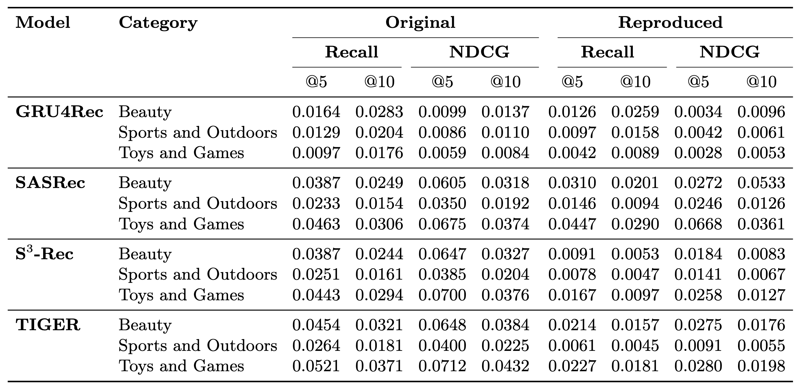
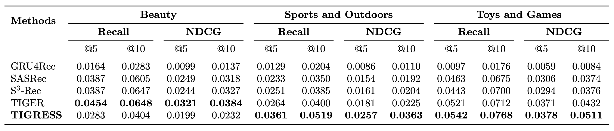
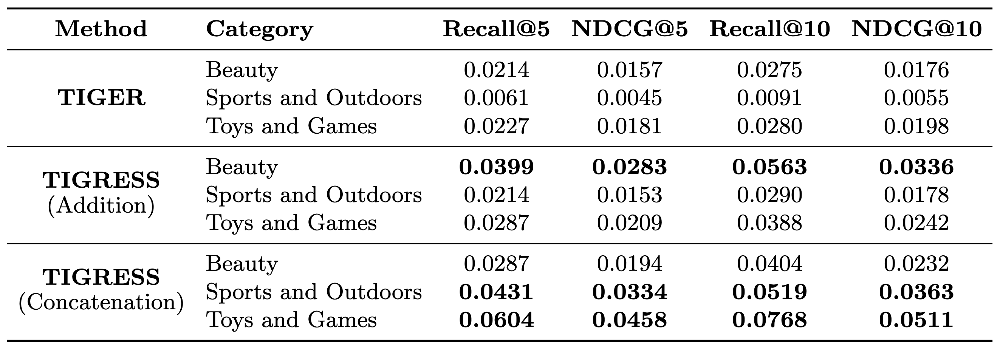
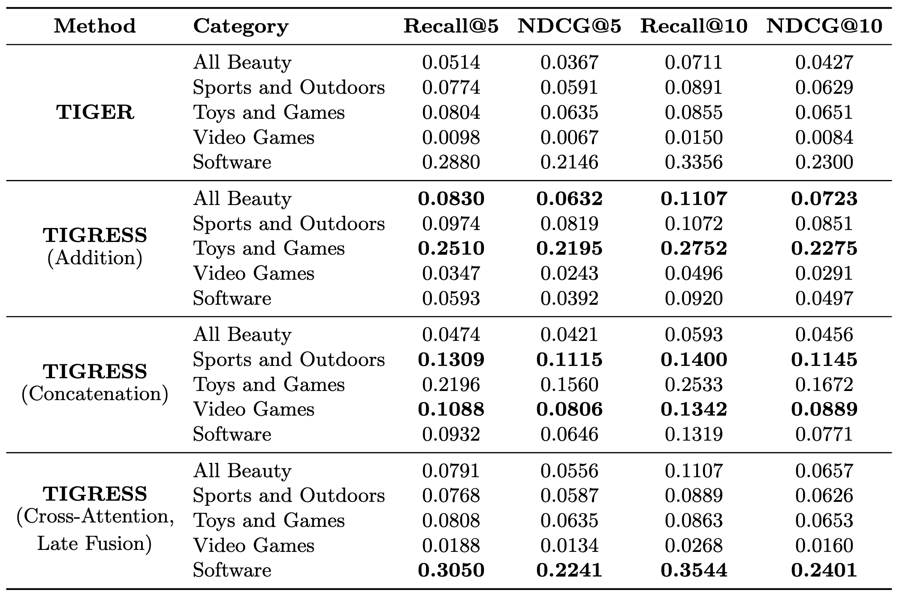
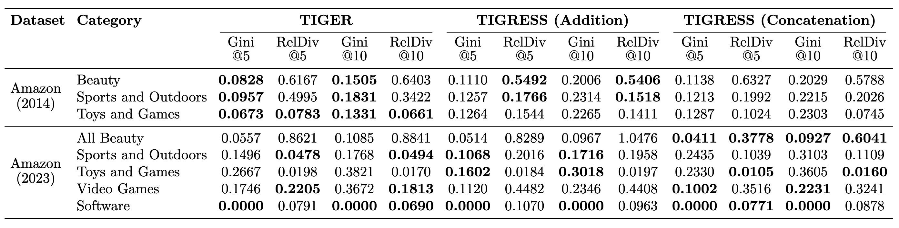
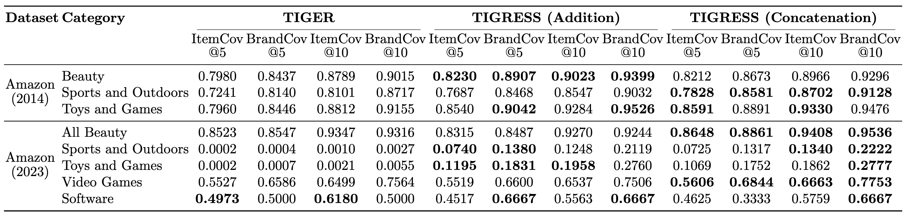
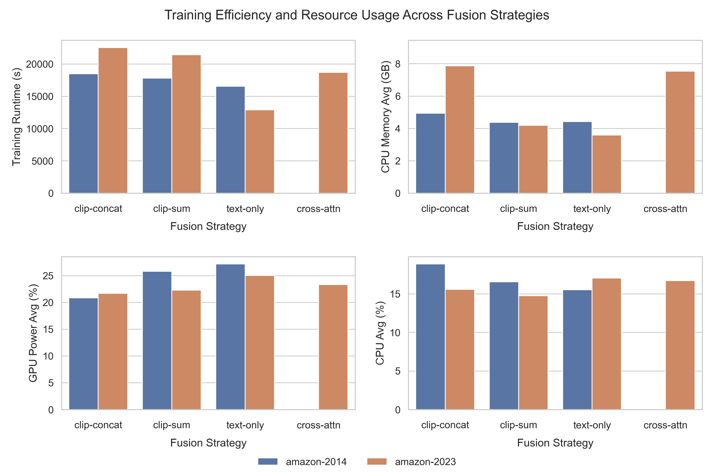

# Supplementary Material

This supplementary material provides detailed experimental results for the TIGER and TIGRESS models across multiple metrics, datasets, and fusion strategies. We include:  

- **Reproducibility**: Comparison of original published results with our reproduced results on Amazon (2014) for multiple sequential recommendation models.  
- **Recall and NDCG**: Performance evaluation at cutoffs 5 and 10 on Amazon (2014) and Amazon (2023), including TIGER and TIGRESS with Addition, Concatenation, and Cross-Attention Late Fusion strategies.  
- **Fairness**: Metrics evaluating the distributional equity of recommendations across product categories.  
- **Diversity**: Metrics capturing item and brand coverage to assess recommendation variety.  
- **Baselines**: Comparisons against standard sequential recommendation models.  

The following sections summarize these results with figures derived from the saved tables.

### Reproducibility of Original Experiments

Comparison of original published results with our reproduced results on Amazon (2014) for multiple sequential recommendation models.

### Baselines

Comparison of TIGRESS (concatenation fusion) to different baseline sequential recommendation models on Amazon 2014. The results for other methods are directly copied from the original paper of TIGER.

### TIGER and TIGRESS (2014)

Reproduced results for TIGER and TIGRESS (Addition and Concatenation) on Amazon (2014). Best values per metric are highlighted in the table.

### TIGER and TIGRESS (2023)

Reproduced results for TIGER and TIGRESS (Addition, Concatenation, Cross-Attention Late Fusion) on Amazon (2023). Best values per metric are highlighted.

### Fairness Analysis

Comparison of TIGER and TIGRESS with two fusion strategies (Addition and Concatenation) on fairness metrics at cutoffs 5 and 10 across Amazon (2014) and Amazon (2023) categories.

### Diversity Analysis

Comparison of TIGER and TIGRESS with two fusion strategies on diversity metrics at cutoffs 5 and 10 across Amazon (2014) and Amazon (2023) categories.

### Training Efficiency and Resource Usage

- **Runtime:** Cross-Attention fusion incurs higher training times compared to simple fusion strategies (Addition, Concatenation), while text-only models are fastest.

- **CPU Memory:** Concatenation slightly increases CPU memory use compared to Addition; Cross-Attention uses more. Text-only models remain lightweight.

- **GPU Power:** Power consumption scales with model complexity and fusion strategy.

- **CPU Usage:** All models maintain moderate CPU utilization, with small increases for more complex fusion strategies.

